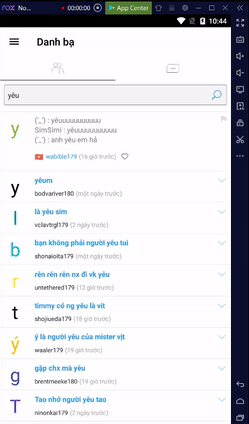

# simsimi

Tool for practice uiautomator for android.
<p align="center"></p>

## Usage
- Install NoxPlayer v6.6.1.2 (contains adb v1.0.36, so need copy adb files to ./platform_tools ) or Android Studio Emulator (some app can't install with x86)

- Install uiautomator from https://github.com/xiaocong/uiautomator
    ```bash
    pip install uiautomator
    ```
- Setup ANDROID_HOME
    ```python
    os.environ["ANDROID_HOME"] = path_of_platform_tools
    ```
## Feature
- [x] Click and scroll to dump xml data
- [ ] Set text and click search
- [ ] Close ads
